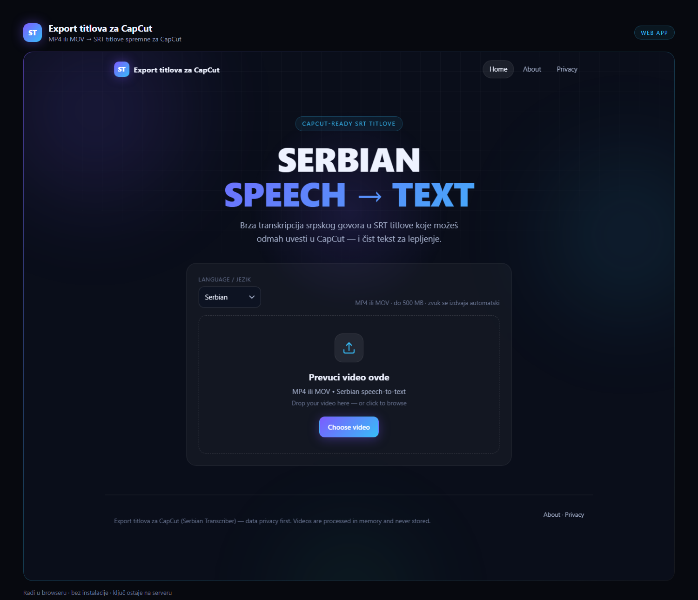
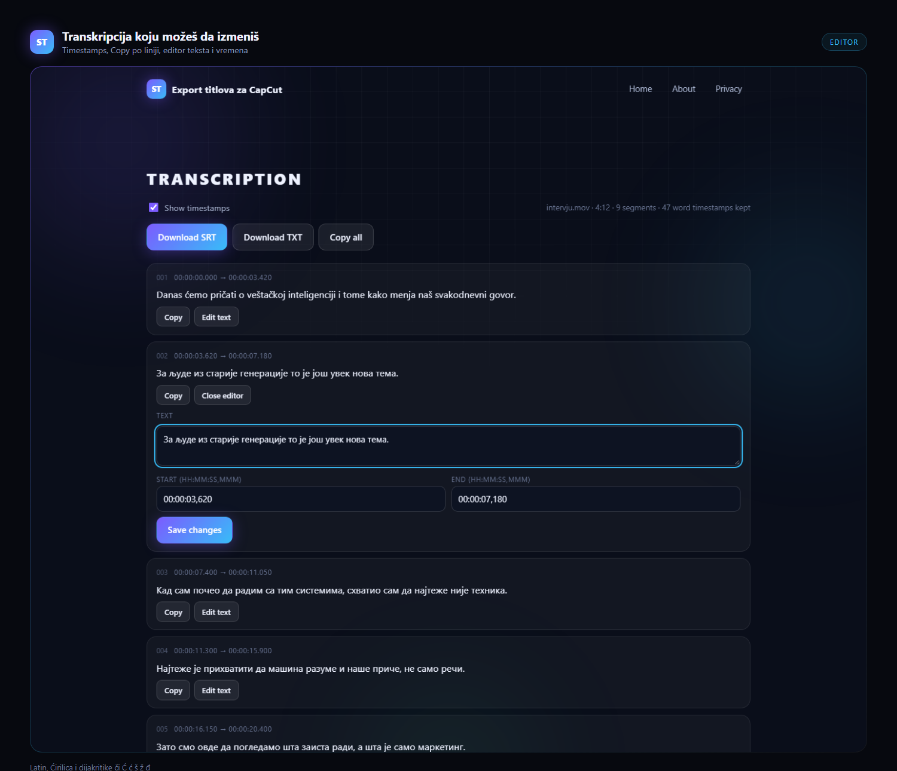

# Export titlova za CapCut (Serbian Transcriber)

Transcribe Serbian speech from MP4/MOV videos into downloadable **SRT subtitles you can import straight into CapCut**, plus **clean plain text** — built for TikTok, YouTube Shorts, Instagram Reels, interviews and podcasts.

## Workflow: video → titlove → CapCut

1. Upload the video here and transcribe it.
2. Click **Download SRT** — you get a file like `video.sr.srt`.
3. In CapCut: **Text → Import subtitles → Import file**, pick the `.srt`.
4. CapCut splits the timeline automatically; then style, animate and export.

Edits you make in the web viewer before download are reflected in the imported file.

Plain HTML5 + CSS3 + vanilla JS frontend (GitHub Pages ready) · Node.js + Express backend · Groq Speech-to-Text (Whisper). The Groq API key lives **only** on the backend and is never exposed to the browser.

| | |
|---|---|
| **Repo** | https://github.com/dexilio13-ui/export-titlova-za-capcut |
| **Frontend (Pages)** | https://dexilio13-ui.github.io/export-titlova-za-capcut/ |
| **Backend API** | https://export-titlova-za-capcut-1.onrender.com |

> **Ako ti treba vodič korak-po-korak za početnike** (kako koristiti sajt, kako uvesti titlove u CapCut, kako sam podesi svoj deploy) — vidi **[docs/VODIC-ZA-POCETNIKE.md](docs/VODIC-ZA-POCETNIKE.md)**.

## Screenshots





```
User → GitHub Pages (static frontend) → Node.js API → Groq Whisper → JSON timestamps → SRT + TXT
```

## Features

- Drag & drop upload (`.mp4`, `.mov`) with validation and preview
- Serbian-first transcription: Latin + Cyrillic, diacritics č ć š ž đ, punctuation preserved
- Language selector: Auto, Serbian, English, Croatian, Bosnian, Montenegrin
- Segment **and** word timestamps (word-level kept in state for future karaoke/ASS features; graceful fallback to segments when unavailable)
- Valid SRT generation (`HH:MM:SS,mmm`, sequential numbers, UTF-8)
- Clean TXT transcript (no numbers/timestamps, line-per-phrase)
- Editable lines before download (text + start/end)
- Per-line Copy, Copy all, Download SRT, Download TXT
- Live progress with 5 pipeline stages and friendly error messages
- No permanent storage: uploads are temp files deleted right after transcription

## Architecture

```
serbian-transcriber/
├── frontend/               # deploy to GitHub Pages (static)
│   ├── index.html
│   ├── about.html
│   ├── privacy.html
│   ├── css/style.css
│   ├── js/
│   │   ├── config.js       # ← set your backend URL here
│   │   ├── transcription.js # SRT/TXT generation, time formatting
│   │   ├── ui.js           # DOM helpers, progress, transcript viewer
│   │   ├── upload.js       # validation, XHR upload, error mapping
│   │   └── app.js          # controller/state
│   └── assets/
└── backend/                # deploy to Render/Railway/Fly/etc.
    ├── server.js
    ├── routes/transcribe.js
    ├── services/groq.js     # Groq API client (server-side only)
    ├── services/normalize.js
    ├── middleware/          # CORS + error handling
    ├── utils/               # logger, temp files, error mapping
    └── test/                # node:test unit tests
```

## Local development

**Backend:**

```bash
git clone https://github.com/dexilio13-ui/export-titlova-za-capcut.git
cd export-titlova-za-capcut/backend

npm install
cp .env.example .env         # then edit .env and add your GROQ_API_KEY
npm run dev                  # http://localhost:3000
```

**Frontend** (do **not** open `index.html` via `file://` — clipboard and CORS behave badly there; serve it over HTTP):

```bash
# from the repo root, any static server works:
cd frontend
python3 -m http.server 8080  # or: npx serve .
# open http://localhost:8080
```

The frontend ships configured for `http://localhost:3000` (see `frontend/js/config.js`).

**Tests:**

```bash
cd backend
npm test
```

## Groq API setup

1. Create a free account at <https://console.groq.com>.
2. Go to **API Keys** → <https://console.groq.com/keys> → *Create API Key*.
3. Copy the key (`gsk_…`) into `backend/.env` as `GROQ_API_KEY`.

The app uses the current Speech-to-Text endpoint `POST https://api.groq.com/openai/v1/audio/transcriptions` with model `whisper-large-v3-turbo` (fast, $0.04/h) — switch to `whisper-large-v3` (highest accuracy, $0.111/h) via `GROQ_MODEL`. Requests use `response_format=verbose_json` with `timestamp_granularities[]=segment` and `[]...=word`.

**Groq file limits: 25 MB on the free tier, 100 MB on the dev tier.** `MAX_FILE_SIZE_MB` must match your tier. Large uploads are fine as long as ffmpeg is available (see Backend deployment), because the audio track is extracted and compressed before the call.

## Environment variables (backend)

| Variable | Required | Default | Purpose |
|---|---|---|---|
| `GROQ_API_KEY` | ✅ | — | Your Groq secret. Server-only, never sent to the browser. |
| `PORT` | — | `3000` | HTTP port. |
| `MAX_FILE_SIZE_MB` | — | `25` | Cap for the file **sent to Groq** — this is the Groq tier limit (25 free / 100 dev). |
| `MAX_UPLOAD_MB` | — | `= MAX_FILE_SIZE_MB` | Cap for the video **uploaded to us**. With ffmpeg enabled, anything bigger than `MAX_FILE_SIZE_MB` is converted to compact audio first, so 500 MB videos are fine. |
| `ALLOWED_ORIGINS` | ✅ (prod) | — | Comma-separated CORS allow-list, e.g. `https://dexilio13-ui.github.io`. |
| `GROQ_MODEL` | — | `whisper-large-v3-turbo` | `whisper-large-v3` for max accuracy. |
| `FFMPEG_PATH` | — | auto-detected | Absolute path to `ffmpeg`. Enables `.mov` + oversized videos. The Docker image sets `/usr/bin/ffmpeg`. |
| `FFMPEG_TIMEOUT_MS` | — | `300000` | Abort audio conversion after this long. |
| `NODE_ENV` | — | `development` | Set to `production` in deployment (enables strict CORS). |

`.env` is git-ignored. **Never commit it.**

## Backend deployment (Render — free tier)

Two ways. The Docker one is recommended, because it ships **ffmpeg** and therefore supports `.mov` files and videos larger than the Groq limit.

### Option A — Blueprint + Docker (recommended: ffmpeg included)

`render.yaml` in the repo root already describes the service.

1. On <https://render.com> → **New → Blueprint** → select your repo → Render reads `render.yaml`.
2. Render asks for `GROQ_API_KEY` (the value is never stored in git) → paste it.
3. Click **Apply**. First build takes a few minutes because it installs ffmpeg.

To convert an **existing** service to Docker instead: Dashboard → your service → **Settings** → Build Method → **Docker**.

### Option B — Plain Node service (no ffmpeg)

1. <https://render.com> → **New → Web Service** → connect your repo.
2. **Root directory:** `backend` · Build `npm install` · Start `npm start`
3. Env vars: `GROQ_API_KEY`, `NODE_ENV=production`, `ALLOWED_ORIGINS=https://dexilio13-ui.github.io`
4. Deploy.

Without ffmpeg, MP4 files up to the Groq limit work directly; `.mov` and bigger files are refused with a clear message.

Render free services sleep after inactivity — the first request may take ~30 s. Railway (<https://railway.app>) and Fly.io (<https://fly.io>) are drop-in alternatives with the same env-var setup.

### What ffmpeg buys you

With `FFMPEG_PATH` set (or the Docker image), the backend extracts a compact **mono 16 kHz Opus** track before calling Groq:

- `.mov` files work, even though Groq itself does not accept MOV
- a 300 MB video becomes roughly 2–15 MB of audio, comfortably inside the 25 MB Groq cap
- ~14 MB of audio per hour, so hour-long interviews and podcasts fit
- if extraction fails (e.g. the clip is muted), the user gets a clear message instead of a stack trace

## GitHub Pages deployment (frontend)

1. Push the repo to GitHub (commands below).
2. Enable Pages: repo **Settings → Pages → Source: GitHub Actions**.
3. The included workflow `.github/workflows/deploy-pages.yml` deploys `/frontend` on every push to `main`.
4. Your site: `https://dexilio13-ui.github.io/export-titlova-za-capcut/`.
5. Update `frontend/js/config.js`:

```js
window.APP_CONFIG = {
  API_BASE_URL: "https://your-service.onrender.com",
};
```

6. Make sure the backend's `ALLOWED_ORIGINS` includes `https://dexilio13-ui.github.io`.

## CORS

The backend answers only to origins listed in `ALLOWED_ORIGINS` (comma-separated). No wildcard in production. For Pages projects the origin is `https://USERNAME.github.io` (no path). Local development (`localhost`) is always allowed while `NODE_ENV` is not `production`.

## GitHub setup (exact commands)

```bash
cd export-titlova-za-capcut
git init
git add .
git commit -m "Export titlova za CapCut: initial release"
git branch -M main
git remote add origin https://github.com/dexilio13-ui/export-titlova-za-capcut.git
git push -u origin main
```

Then enable Pages via **Settings → Pages → GitHub Actions** (see above).

## Troubleshooting

| Symptom | Cause & fix |
|---|---|
| `413 File is too large` | Groq free tier caps at 25 MB. Shrink with ffmpeg: `ffmpeg -i in.mp4 -vn -ac 1 -ar 16000 -c:a flac out.flac`, or raise the limit only if your Groq tier allows it. |
| MOV rejected | Groq accepts mp3/mp4/m4a/wav/webm/… but not `mov`. Deploy with Docker/ffmpeg and the backend converts it automatically; otherwise upload MP4. |
| "We could not read the audio track" | The video has no audio stream (muted/silent clip) or an unsupported codec. |
| `Could not reach the server` | `API_BASE_URL` in `frontend/js/config.js` is wrong or backend asleep/cold. Retry once, then check the Render dashboard. |
| CORS error in console | `ALLOWED_ORIGINS` must contain the exact Pages origin (`https://USERNAME.github.io`). |
| Empty/poor transcript | No speech or heavy music. Try `GROQ_MODEL=whisper-large-v3` and pick **Serbian** in the selector. |
| Long video times out | Extract audio and trim before uploading; a 10-min Shorts video should be well under 25 MB as mono 16 kHz audio. |

## Security notes

- `GROQ_API_KEY` exists only as a backend env var — grep the frontend: there is no key in any shipped JS file.
- Uploads are validated (extension, MIME, size), stored under random temp names, path-traversal-safe, and deleted immediately after the API call. A background sweep removes anything older than 1 h from crashed runs.
- Errors returned to clients are generic; stack traces and API details stay in server logs, which redact key-like fields.

## How SRT works

SubRip (`.srt`) is a plain-text subtitle format: a sequential number, a timing line `HH:MM:SS,mmm --> HH:MM:SS,mmm` (note the **comma** before milliseconds), the subtitle text, and a blank line. Example:

```
1
00:00:00,000 --> 00:00:02,500
Danas ćemo pričati o veštačkoj inteligenciji.

2
00:00:02,500 --> 00:00:05,100
Ovo je jednostavan primer transkripcije.
```

Files are UTF-8 so Serbian diacritics (č ć š ž đ) render correctly in players and editors.

## License

MIT — see [LICENSE](LICENSE).
